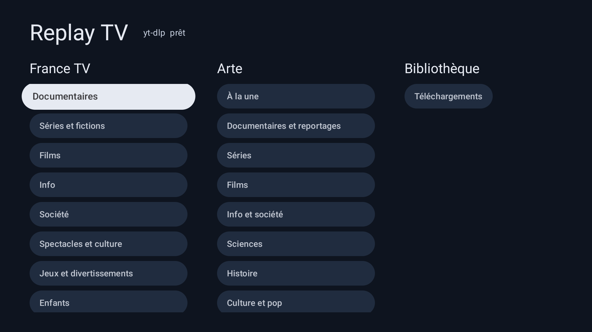
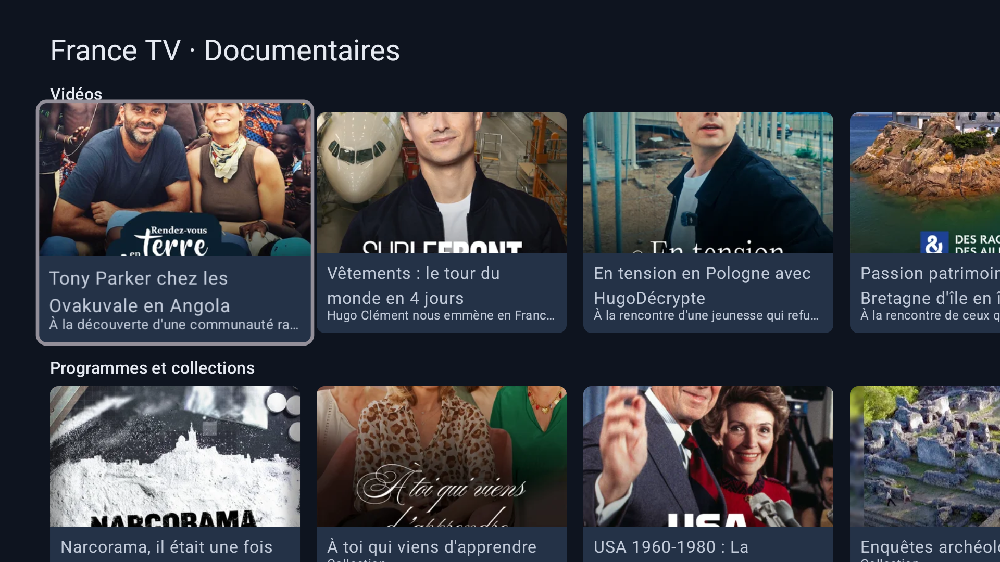
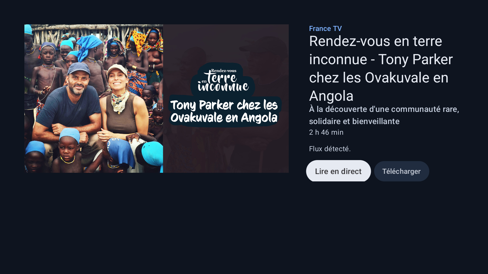
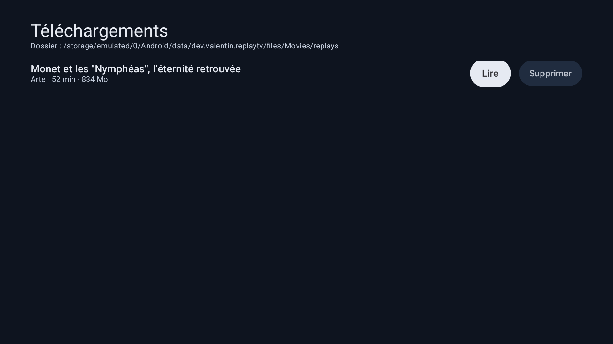

# Replay TV — prototype Android TV

Prototype d'application Android TV (testée pour une box Google TV Streamer) qui permet de
**parcourir, lire et télécharger les replays** des chaînes gratuites françaises, directement
depuis la télévision, sans ordinateur.

> Captvty lui-même est un logiciel propriétaire (.NET/Windows, « gratuit mais pas libre », sa
> licence interdit la réutilisation). Il ne peut pas être empaqueté dans un APK. Ce projet
> reproduit la fonctionnalité avec des composants libres : le catalogue est lu sur les sites
> des chaînes, et l'extraction/le téléchargement sont confiés à **yt-dlp**, embarqué dans l'APK.

## Ce que fait le prototype

| Fonction | État |
|---|---|
| Catalogue France TV (documentaires, séries, films, info, …, programmes et épisodes) | OK, par lecture des pages HTML de france.tv |
| Catalogue Arte (à la une, documentaires, séries, films, …, collections) | OK, via l'API publique EMAC d'Arte |
| Lecture en streaming (HLS, jusqu'en 1080p) | OK, Media3/ExoPlayer |
| Téléchargement en MP4 dans la box, avec progression et notification | OK, yt-dlp + ffmpeg embarqués, service au premier plan |
| Lecture des fichiers téléchargés | OK |
| TF1+ / M6+ | **Non** : les flux sont protégés par DRM (Widevine). yt-dlp refuse, et il n'existe pas de moyen légal de les télécharger. Captvty bute sur la même limite. |
| Navigation à la télécommande (D-pad, Retour) | OK, Compose for TV |
| Recherche, reprise de téléchargement, sous-titres | Pas encore |

Testé en amont (poste de travail, yt-dlp 2026.08.19) : France TV et Arte fournissent des
flux HLS 1080p **sans DRM** ; TF1 renvoie `This video is DRM protected`.

## Aperçu

Captures prises sur l'émulateur Android TV (API 36, x86_64) lors du test de bout en bout :
accueil → catalogue France TV → fiche vidéo → lecture HLS → téléchargement → lecture du MP4 local.

| Accueil | Catalogue France TV |
|---|---|
|  |  |

| Fiche vidéo | Téléchargements |
|---|---|
|  |  |

### Tester sans box : émulateur Android TV dans Docker

`scripts/emulator-smoke.sh` installe l'image système Android TV, démarre un émulateur headless
(KVM requis), installe l'APK x86_64 et déroule le scénario ci-dessus en prenant des captures
dans `.cache/smoke/`. Le conteneur `replaytv-emu` reste disponible ensuite pour `adb`.

## Architecture

```
app/src/main/java/dev/valentin/replaytv/
├── ReplayTvApp.kt            Application : OkHttp, yt-dlp, catalogue, gestionnaire de téléchargements
├── MainActivity.kt           Activité Leanback (Compose for TV)
├── model/Catalog.kt          Source, Section, CatalogItem (Video | Collection), CatalogRow
├── catalog/
│   ├── FranceTvCatalog.kt    Lecture des cartes <a data-card-link> des pages france.tv
│   ├── ArteCatalog.kt        API EMAC (pages), API player (métadonnées), yt-dlp (collections)
│   └── CatalogRepository.kt  Dispatch par source
├── ytdlp/YtDlp.kt            Façade youtubedl-android : init, `-J` (analyse), `--flat-playlist`, téléchargement
├── download/
│   ├── DownloadManager.kt    File d'attente séquentielle, état observable, métadonnées JSON à côté des MP4
│   └── DownloadService.kt    Service au premier plan + notification de progression
├── player/PlayerActivity.kt  ExoPlayer plein écran (HLS distant ou fichier local)
└── ui/                       Home, Browse (rangées de cartes), Detail, Downloads, thème
```

Flux d'une vidéo : carte du catalogue → `yt-dlp -J <url>` sur la box → manifeste HLS
(lecture directe) ou `yt-dlp -o … -f "bestvideo[height<=1080]+bestaudio/best"` (téléchargement,
fusion MP4 par ffmpeg) → fichier dans
`Android/data/dev.valentin.replaytv/files/Movies/replays/`.

Composants principaux :

- [youtubedl-android](https://github.com/yausername/youtubedl-android) 0.18.1 : Python + yt-dlp + ffmpeg
  pour Android (arm64-v8a, x86_64). yt-dlp est mis à jour indépendamment de l'APK
  (`YoutubeDL.updateYoutubeDL`, pas encore branché dans l'UI).
- Jetpack Compose + `androidx.tv:tv-material` pour l'interface télécommande.
- Media3 ExoPlayer 1.11 (HLS).
- OkHttp, kotlinx-serialization, Coil.

## Télécharger l'APK

Les APK sont publiés dans les [releases GitHub](https://github.com/idkw/captvty-android-tv/releases)
(`replaytv-<version>-arm64-v8a.apk` pour la box). Pousser un tag `vX.Y.Z` déclenche la
construction et la publication par GitHub Actions (`.github/workflows/release.yml`).

## Compiler

### Sans Android Studio (Docker)

```bash
scripts/build-docker.sh                 # assembleDebug
ls app/build/outputs/apk/debug/         # app-arm64-v8a-debug.apk, app-x86_64-debug.apk
```

Premier lancement long (téléchargement de Gradle, du SDK Android et des dépendances) ;
les caches sont conservés dans `.cache/`.

### Avec Android Studio

Ouvrir le dossier, laisser le SDK 36 s'installer, `Run` sur un appareil Android TV.

## Installer sur la box

1. Sur la box : Paramètres → Système → À propos → appuyer 7 fois sur « Build » pour activer
   les options développeur, puis activer **Débogage USB** / **Débogage réseau (ADB)**.
2. Depuis le poste (box et PC sur le même réseau) :

```bash
adb connect <ip-de-la-box>:5555
adb install -r app/build/outputs/apk/debug/app-arm64-v8a-debug.apk
```

L'application apparaît dans le lanceur Google TV sous « Replay TV ».

## Limites connues et pistes

- **DRM** : TF1+ et M6+ sont hors de portée (Widevine). France TV et Arte couvrent l'essentiel
  des documentaires/fictions du service public.
- Le catalogue France TV dépend du HTML du site : un changement de balisage casse la lecture
  des cartes (`FranceTvCatalog.parseCards`). L'API EMAC d'Arte est plus stable.
- Pas de permission de stockage demandée : les fichiers sont dans le dossier privé de l'app
  (supprimés à la désinstallation). Pour les voir depuis un autre lecteur, il faudra passer par
  `MediaStore` ou un dossier public.
- Pas encore : recherche, mise à jour de yt-dlp depuis l'UI, sous-titres, reprise après coupure,
  limite d'espace disque.
- Les téléchargements tournent dans un service au premier plan ; l'application peut rester en
  arrière-plan pendant ce temps.
